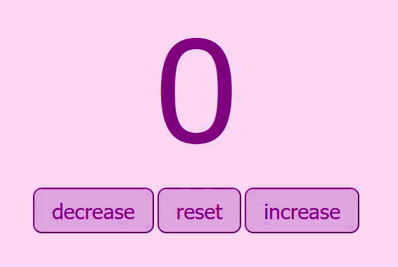

# 🔢 Counter

> A simple counter app built while learning HTML, CSS, and JavaScript.

## 🎬 Demo

## ✨ Features

- ➕ Increase the count
- ➖ Decrease the count
- 🔄 Reset back to zero

## 🛠️ Tech Used

- HTML
- CSS
- JavaScript

## 🚀 How to Run

1. Clone or download the repo
2. Open `counter.html` in your browser
3. Start clicking!

---